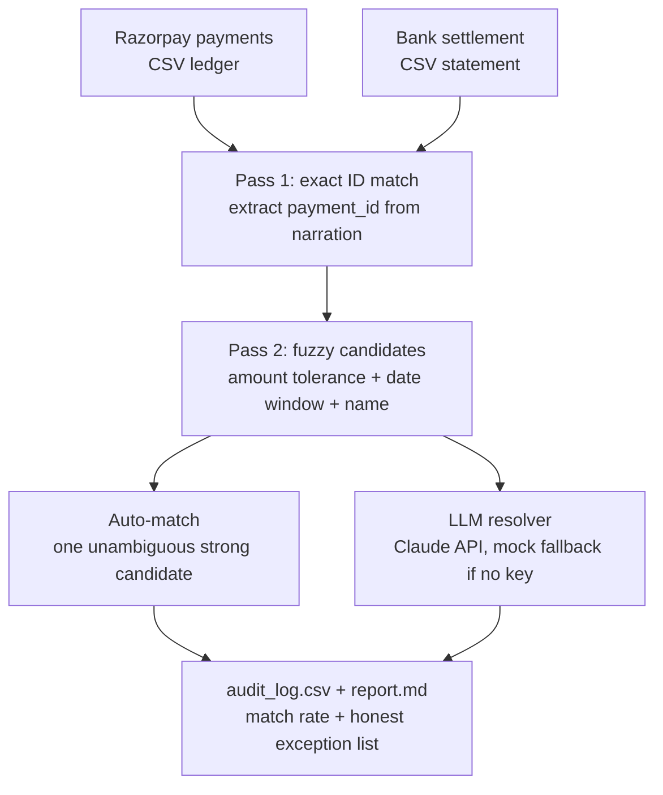

# Reconciliation agent — Razorpay AI Buildathon 2026, Track 04 (AI Finance Controller)

An agent that reconciles a merchant's Razorpay payment ledger against a bank
settlement file, matches what it can with rules, hands the genuinely ambiguous
cases to an LLM for a judgment call, and reports an honest match rate plus
everything it couldn't resolve.

## The problem

Every payment platform has this gap: money moves through Razorpay, then
separately shows up (or doesn't) in the merchant's bank account, days later,
with a different reference format, minus fees, sometimes duplicated, sometimes
never. A finance team currently does this matching by hand in a spreadsheet.
This agent automates the matching and, just as importantly, is honest about
what it can't match automatically.

## Architecture



Three-pass strategy, cheapest and most certain first:

1. **Exact match** — regex-extract a `payment_id` straight out of the bank
   narration text. No AI needed when the bank preserves the reference.
2. **Fuzzy filter** — for everything left, narrow candidates by settlement
   amount (post-fee, with tolerance), a settlement-date window, and name
   similarity. If exactly one candidate is a near-perfect fit, auto-match
   without spending an LLM call on it.
3. **LLM resolver** — genuinely ambiguous cases (truncated narration, more
   than one plausible candidate) go to Claude with the payment and its
   candidates, and get a match/no-match decision with reasoning attached.

Anything still unresolved after all three passes is reported as an honest
exception, not hidden or force-matched.

## A deliberate design choice: graceful degradation

`llm_resolver.py` supports two interchangeable LLM providers — use whichever
key you have:

| Env var | Effect |
|---|---|
| `ANTHROPIC_API_KEY` | Calls Claude |
| `OPENAI_API_KEY` | Calls OpenAI |
| `LLM_PROVIDER=anthropic` or `openai` | Forces a provider if both keys are set |
| *(neither set)* | **MOCK mode** — transparent heuristic fallback |

Every mock decision is labeled `[MOCK - no LLM key set]` in the audit log, so
the pipeline never silently fakes an AI judgment as verified. A missing key,
an expired key, a rate limit, or a malformed response from either provider
all degrade to the same logged fallback instead of crashing the run. This
was actually tested, not just designed: the full pipeline was run with no
key configured (results below), and separately with a deliberately invalid
`OPENAI_API_KEY` to confirm a real call failure gets caught and logged rather
than crashing — see the `[<provider> call failed: ...]` prefix that produces
in `reasoning` when that happens.

## How to run it

```bash
pip install -r requirements.txt
python3 generate_data.py        # creates data/razorpay_payments.csv and data/bank_settlement.csv

cp .env.example .env            # then edit .env and add ONE real key - it's git-ignored
python3 run_reconciliation.py   # writes audit_log.csv and report.md
```

No `.env` file, or an empty one, runs the pipeline in mock mode — see above.

**Never commit `.env` or paste a real key anywhere public** (chat, code, commit
messages, screenshots). If a key is ever exposed, revoke it immediately at
your provider's dashboard and generate a new one.

## Real results from this repo's last run

*(mock mode — no API key was set; see `report.md` for the full file)*

- **Total Razorpay payments:** 65
- **Matched to a bank settlement:** 58 (**89.2%**)
- **LLM resolver calls made:** 12 (all mock-mode, clearly labeled)
- **Matched via exact ID:** 46
- **Matched via LLM judgment:** 12
- **Unresolved exceptions (payment side):** 7 — no settlement found in window
- **Bank-side exceptions:** 3 unexplained credits, 2 duplicate settlements

That 89.2% is the real number this code produced on synthetic data with
randomized noise, not a cherry-picked run — see the honest exception list at
the bottom of `report.md` for exactly which records didn't resolve and why.

## What this doesn't do (yet)

- Data is synthetic, generated by `generate_data.py`, not real Razorpay
  settlement files — the field names and narration formats are realistic
  approximations, not a live API integration.
- The fuzzy matcher's name-similarity check is a simple substring heuristic,
  not proper fuzzy string matching (e.g. Levenshtein) — good enough for this
  demo's data, not production-grade.
- No handling yet for partial settlements (a single payment split across two
  bank credits) — currently that would show up as an unresolved exception,
  which is at least honest, but not resolved.

## Files

| File | Purpose |
|---|---|
| `generate_data.py` | Creates the two synthetic ledgers with realistic messiness |
| `reconcile.py` | Exact-match and fuzzy-candidate logic |
| `llm_resolver.py` | LLM judgment call for ambiguous matches, with mock fallback |
| `run_reconciliation.py` | Orchestrates the pipeline, writes audit log + report |
| `audit_log.csv` | Per-record decision trail (generated) |
| `report.md` | Human-readable summary with the honest exception list (generated) |
